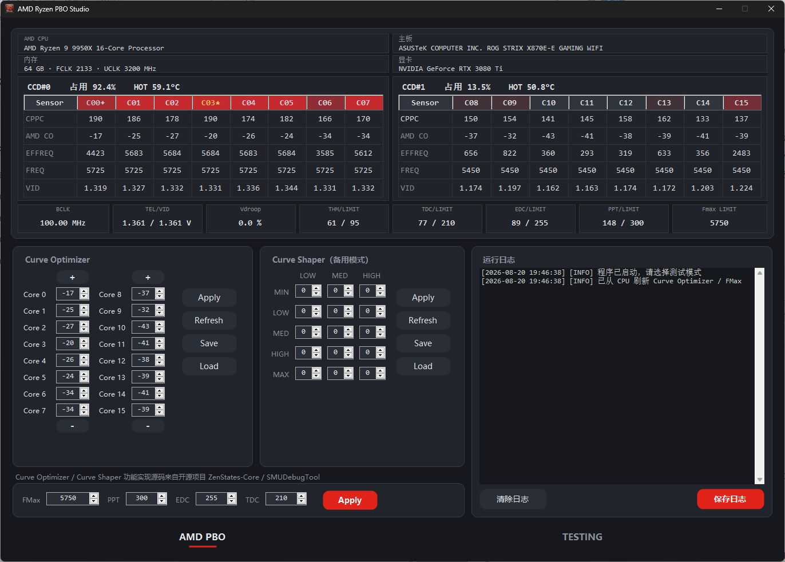
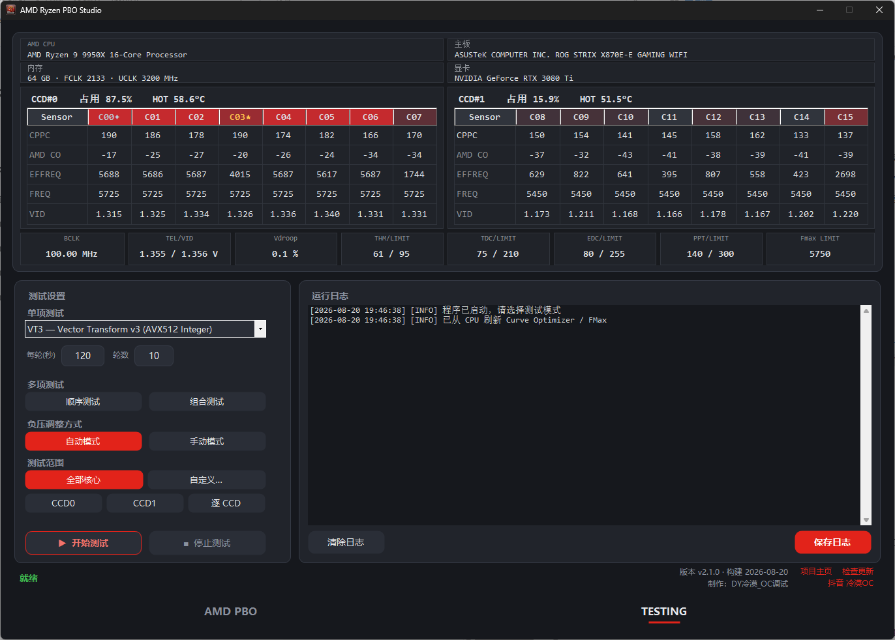

# AMD Ryzen PBO Studio

面向 AMD Ryzen CPU 的 PBO Studio 调节工具 (现已支持5000/7000/9000系CPU)




## 功能

### 实时监控

频率读数优先采用 HW P-state 快照 MSR `0xC0010293`
若 HWiNFO 正在运行并已开启共享内存，则直接采用HWINFO传感器数据为准。

### 手动调参

- **Curve Optimizer**：逐物理核心设置负压偏移，支持配置存档与载入
- **Curve Shaper**：5 个频率档 × 3 个温度档的完整网格 
- **PBO Limit**：FMax、PPT、EDC、TDC 一次性下发 

### 自动负压测试

提供三种压测编排：

| 模式 | 说明                                                         |
| ---- | ------------------------------------------------------------ |
| 单项 | 从 VT3、BKT、SVT、BBP、SFTv4、SNT、FFTv4、N63 中指定一种算法 |
| 顺序 | VT3 → BKT → SVT 依次执行，默认 20 / 10 / 10 轮             |
| 组合 | VT3,BKT,SVT三种算法组合测试，默认 10 轮                      |

每轮时长与轮数可自行设定，默认120s/轮

测试范围可再行限定：

| 范围     | 说明                                     |
| -------- | ---------------------------------------- |
| 全部核心 | 所有核心一起压测                         |
| 自定义   | 自行勾选参与压测的核心                   |
| 单个 CCD | 只压指定的那个 CCD（双 CCD可见）        |
| 逐 CCD   | 每个 CCD 各跑一遍完整轮次（双 CCD可见） |

限定范围后，未选中的核心保持空闲。需要注意单 CCD 压测时功耗预算集中在被测 CCD 上，频率会高于
全核负载的情形，得到的结论不能直接套用到全核。

测试过程中若 y-cruncher 报出运算错误，程序解析出错的逻辑核心并
映射到物理核心，将其负压回退一档（默认 +2）后重跑整轮，直至通过。

可切换为手动模式：报错时仅提示并停止，不改动任何已设定的参数。

### 异常中断恢复

负压历史保存到本地硬盘，死机重启读取时自动跳过并回溯至前一条有效记录。

## 环境要求

| 项目     | 要求                                                                                                      |
| -------- | --------------------------------------------------------------------------------------------------------- |
| 处理器   | AMD Ryzen 5000 / 7000 / 9000 系 CPU                                                                       |
| 操作系统 | Windows 10 / 11 x64                                                                                       |
| 运行环境 | [.NET 8 Desktop Runtime](https://dotnet.microsoft.com/download/dotnet/8.0)                                 |
| 驱动     | [PawnIO](https://pawnio.eu)。程序的全部硬件读写（SMU 命令、MSR、SMN 寄存器）都经由它进行，未安装则无法启动 |
| 权限     | 管理员身份运行                                                                                            |

各世代可用的功能有所差异：

| 功能            | 5000 系               | 7000 系 | 9000 系 |
| --------------- | --------------------- | ------- | ------- |
| Curve Optimizer | 支持                  | 支持    | 支持    |
| Curve Shaper    | 不支持                | 不支持  | 支持    |
| PPT / EDC / TDC | 支持                  | 支持    | 支持    |
| 修改 FMax       | 不支持                | 支持    | 支持    |
| CPPC 核心排名   | 需在 BIOS 中开启 CPPC | 支持    | 支持    |

5000 系的 CPPC 读数取自 Windows 内核电源事件，BIOS 中未开启 CPPC 时该行显示为空。

## 使用

1. 从 [Releases](https://github.com/lengmo23/RyzenPboStudio/releases) 下载压缩包，解压至任意目录
2. 以管理员身份运行 `AMD Ryzen PBO Studio.exe`
3. 在 **AMD PBO** 页确认监控数据正常读取（每核频率、CO 值均有有效数值）
4. 切换至 **TESTING** 页，选择测试模式并设定每轮时长与轮数，点击「开始测试」
5. 测试结束后，最终负压写入 `profiles\final_offsets.txt`

首次使用建议将每轮时长设为较小值（如 60 秒）以验证整体流程，确认无误后再延长。

程序在自身目录下维护两个文件夹：

- `logs\` —— 运行日志，按 `y-cruncher_yyyyMMdd_HHmmss.log` 命名
- `profiles\` —— 负压历史、恢复状态、CO / Curve Shaper 配置与校准数据

## y-cruncher

压力测试由 [y-cruncher](https://www.numberworld.org/y-cruncher/) 实现。

## 风险提示

Precision Boost Overdrive 属于超频操作。过大的负压设置会导致运算错误、系统冻结、蓝屏或重启，
可能造成未保存数据丢失；持续在不稳定状态下运行存在损伤硬件的风险，并可能影响处理器保修。

本程序依据 GPL-3.0 发布，**不提供任何形式的担保**，使用者需自行评估并承担全部风险。
开始测试前请保存所有正在进行的工作。

## 从源码构建

```powershell
dotnet publish .\RyzenPboStudio\RyzenPboStudio.csproj -c Release -r win-x64 --self-contained false -p:DebugType=None -p:DebugSymbols=false -o .\bin
```

输出为 `bin\` 目录，包含可执行文件及其依赖，整个目录即可分发。若仓库根目录下存在
`y-cruncher v0.8.7.9547b\`，构建时会自动复制到 `bin\tools\y-cruncher\`；不存在则跳过，
不影响构建结果。

## 作者

 [@lengmo23](https://github.com/lengmo23)

Copyright © 2026 [@lengmo23](https://github.com/lengmo23)

## 许可

本项目依据 [GNU General Public License v3.0](LICENSE) 发布。

该选择由依赖关系决定：项目静态链接了同为 GPL-3.0 授权的 ZenStates-Core，依据 GPL 的传染性
条款，衍生作品必须以相同许可发布。

## 第三方组件

- **[ZenStates-Core](https://github.com/irusanov/ZenStates-Core)**（GPL-3.0）——
  SMU 访问层，Curve Optimizer、Curve Shaper 与 PBO 参数的读写均由其实现
- **[SMUDebugTool](https://github.com/irusanov/SMUDebugTool)**（GPL-3.0）——
  SMU 命令标识与 PM Table 字段偏移的参考来源
- **[ryzen-smu-cli](https://github.com/rawhide-kobayashi/ryzen-smu-cli)**（GPL-3.0）——
  随程序分发的 `inpoutx64.dll` 出自该项目
- **[y-cruncher](https://www.numberworld.org/y-cruncher/)** —— 压力测试引擎，
  版权归 Alexander J. Yee 所有

完整的第三方声明与许可条款见 [THIRD-PARTY-NOTICES.txt](THIRD-PARTY-NOTICES.txt)。
