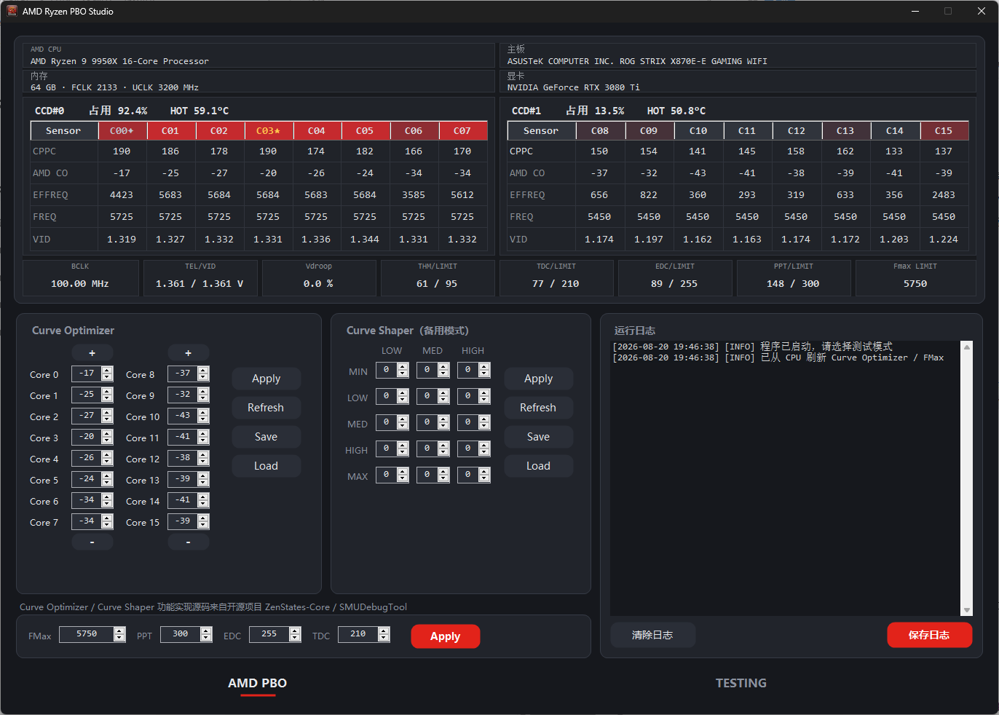
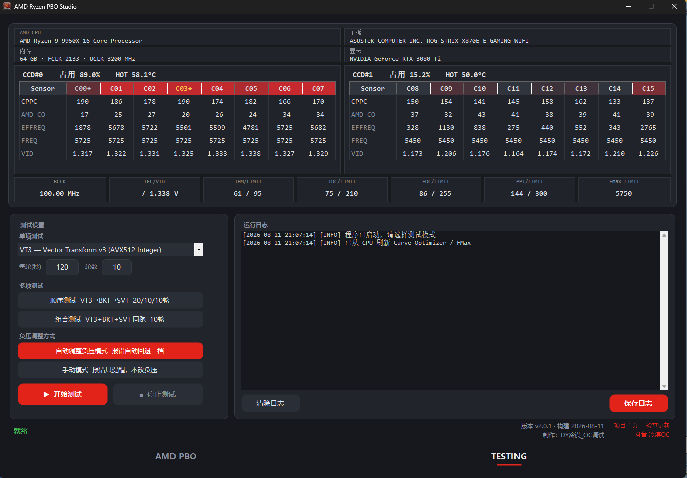

# AMD Ryzen PBO Studio

[English](README.md) | 简体中文

AMD Ryzen 5000 / 7000 / 9000 系处理器的 PBO 调节与 Curve Optimizer 负压自动测试工具。





## 功能

### 实时监控

窗口顶部常驻每核监控，按 CCD 分栏显示：

- 每核 CPPC 排名（金 / 银核标记）、CO 值、有效频率、频率、VID
- 每个 CCD 的平均占用与热点温度
- BCLK（异步外频时显示 BCLK/BCLK2）、TEL/VID、Vdroop、THM、TDC、EDC、PPT、Fmax

每核频率按以下顺序取值：

1. HWiNFO 正在运行且开启了共享内存时，直接用 HWiNFO 的读数
2. 否则读 PM Table 中 SMU 报告的每核频率，并按 BCLK 换算
3. PM Table 读不到时，读 HW P-state 快照 MSR `0xC0010293`

### 手动调参

- **Curve Optimizer**：逐物理核心设置负压，可保存和载入配置
- **Curve Shaper**：5 个频率档 × 3 个温度档
- **PBO 限制**：FMax、PPT、EDC、TDC 一键写入

### 自动负压测试

压测引擎是 y-cruncher，有三种测试方式：

| 模式 | 说明                                                        |
| ---- | ----------------------------------------------------------- |
| 单项 | 从 VT3、BKT、SVT、BBP、SFTv4、SNT、FFTv4、N63 中选一种 |
| 顺序 | VT3 → BKT → SVT 依次跑，默认 20 / 10 / 10 轮            |
| 组合 | VT3、BKT、SVT 同时跑，默认 10 轮                          |

每轮时长可以自己设（默认 120 秒），单项测试的轮数也可以设。

测试范围：

| 范围     | 说明                                 |
| -------- | ------------------------------------ |
| 全部核心 | 所有核心一起压测                     |
| 自定义   | 自己勾选参与压测的核心               |
| 单个 CCD | 只压指定的 CCD（多 CCD 机型才有）    |
| 逐 CCD   | 每个 CCD 各跑一遍（多 CCD 机型才有） |

只压一个 CCD 时，功耗预算集中在这个 CCD 上，频率会比全核负载时高，结论不能直接套用到全核。

负压调整方式：

- **自动模式**：y-cruncher 报错时，把出错的核心负压回退一档（+2）后重跑整轮，直到通过
- **手动模式**：报错时只提示并停止，不改动任何参数

### 死机恢复

每次写入负压前，程序先把这组负压存到硬盘。测试中死机或断电后重新打开程序，再点「开始测试」时，
会读取死机前的负压，所有核心回退一档后从中断的地方继续。

如果中断后你手动应用过 CO，程序会按你设的值继续，不再回退。

### 在线更新

启动时自动检查 GitHub 上的新版本，也可以在 TESTING 页右下角手动检查。GitHub 连不上时会依次尝试
几个加速镜像，都失败则给出网盘下载地址。更新不会动 `logs\` 和 `profiles\`。

## 运行要求

| 项目     | 要求                                                                       |
| -------- | -------------------------------------------------------------------------- |
| 处理器   | AMD Ryzen 5000 / 7000 / 9000 系                                            |
| 操作系统 | Windows 10 / 11 x64                                                        |
| 运行库   | [.NET 8 Desktop Runtime](https://dotnet.microsoft.com/download/dotnet/8.0) |
| 驱动     | [PawnIO](https://pawnio.eu)，未安装无法启动                               |
| 权限     | 管理员                                                                     |

各代处理器支持的功能：

| 功能            | 5000 系           | 7000 系 | 9000 系 |
| --------------- | ----------------- | ------- | ------- |
| Curve Optimizer | 支持              | 支持    | 支持    |
| Curve Shaper    | 不支持            | 不支持  | 支持    |
| PPT / EDC / TDC | 支持              | 支持    | 支持    |
| 修改 FMax       | 不支持            | 支持    | 支持    |
| CPPC 核心排名   | 需 BIOS 开启 CPPC | 支持    | 支持    |

## 使用方法

1. 从 [Releases](https://github.com/lengmo23/RyzenPboStudio/releases) 下载 `-full.zip`（含 y-cruncher），
   解压到任意目录。`-update.zip` 是程序内自动更新用的，不含 y-cruncher，不要用它首次安装
2. 以管理员身份运行 `AMD Ryzen PBO Studio.exe`
3. 在 **AMD PBO** 页确认监控数据正常（每核频率、CO 值都有数字）
4. 切到 **TESTING** 页，选择测试方式和范围，点「开始测试」
5. 测试全部通过后，最终负压写入 `profiles\final_offsets.txt`

程序目录下会生成两个文件夹：

- `logs\`：y-cruncher 每次运行的日志，以及手动导出的运行日志
- `profiles\`：负压历史、恢复状态、CO / Curve Shaper 配置和校准数据

## 风险提示

PBO 和负压调节属于超频。负压过大会导致运算错误、死机、蓝屏或重启，可能丢失未保存的数据；
长期在不稳定状态下运行可能损伤硬件，也可能影响保修。

本程序依据 GNU 通用公共许可证第 3 版（GPL-3.0）发布，**不附带任何形式的担保**，包括但不限于对适销性或特定用途适用性的默示担保。因使用本程序导致的任何数据丢失、硬件损坏或其他直接、间接损失，作者概不负责，相关风险由使用者自行承担。运行压力测试前，请保存并关闭所有正在进行的工作。

## 从源码构建

```powershell
dotnet publish .\RyzenPboStudio\RyzenPboStudio.csproj -c Release -r win-x64 --self-contained false -p:DebugType=None -p:DebugSymbols=false -o .\bin
```

输出在 `bin\`，整个目录即可分发。仓库根目录有 `y-cruncher v0.8.7.9547b\` 时，构建会把它拷到
`bin\tools\y-cruncher\`；没有则跳过。

## 作者

[@lengmo23](https://github.com/lengmo23)

Copyright © 2026 [@lengmo23](https://github.com/lengmo23)

## 许可

本项目按 [GNU General Public License v3.0](LICENSE) 发布。项目静态链接了 GPL-3.0 的 ZenStates-Core，
因此整体也必须使用 GPL-3.0。

## 第三方组件

- [ZenStates-Core](https://github.com/irusanov/ZenStates-Core)（GPL-3.0）：SMU 访问层，
  CO、Curve Shaper 和 PBO 参数的读写都通过它
- [SMUDebugTool](https://github.com/irusanov/SMUDebugTool)（GPL-3.0）：SMU 命令和 PM Table 偏移的参考
- [ryzen-smu-cli](https://github.com/rawhide-kobayashi/ryzen-smu-cli)（GPL-3.0）：`inpoutx64.dll` 的来源
- [y-cruncher](https://www.numberworld.org/y-cruncher/)：压测引擎，版权归 Alexander J. Yee 所有

完整声明见 [THIRD-PARTY-NOTICES.txt](THIRD-PARTY-NOTICES.txt)。
